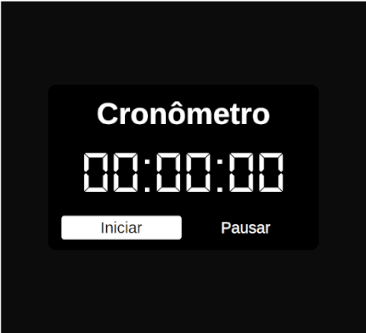

# ⏱️ Cronômetro


Um cronômetro simples e direto, feito com HTML, CSS e JavaScript puros. Exibe horas, minutos e segundos em um visual de display digital com tema escuro.



🔗 **Demo:** [https://eduardo2382.github.io/stopwatch](https://eduardo2382.github.io/stopwatch)

## ✨ Funcionalidades

- Contagem no formato `HH:MM:SS`
- Botão **Iniciar** para começar a contagem
- Botão **Pausar** para interromper o tempo
- Interface escura com fonte estilo display digital

## 🛠️ Tecnologias

- **HTML5** – estrutura da página
- **CSS3** – estilização e layout
- **JavaScript** – lógica do cronômetro

## 🚀 Como executar

Para executar o projeto basta:

```bash
# Clone o repositório
git clone https://github.com/eduardo2382/stopwatch.git

# Entre na pasta
cd stopwatch
```

Depois, abra o arquivo `index.html` no navegador (dois cliques nele já funciona).

## 📁 Estrutura do projeto

```
├── index.html
├── style.css
├── script.js
└── preview.png
```

## 🗺️ Próximos passos

- [x] Melhorar a responsividade para telas menores
- [ ] Refatorar a estilização utilizando **Tailwind CSS**
- [ ] Adicionar botão de **Zerar/Reiniciar**

## 👨‍💻 Autor

Feito por **eduardo2382**

[](https://github.com/eduardo2382)
[](https://instagram.com/edumotaa__)
[](https://www.linkedin.com/in/eduardo-mota-3304503b2)